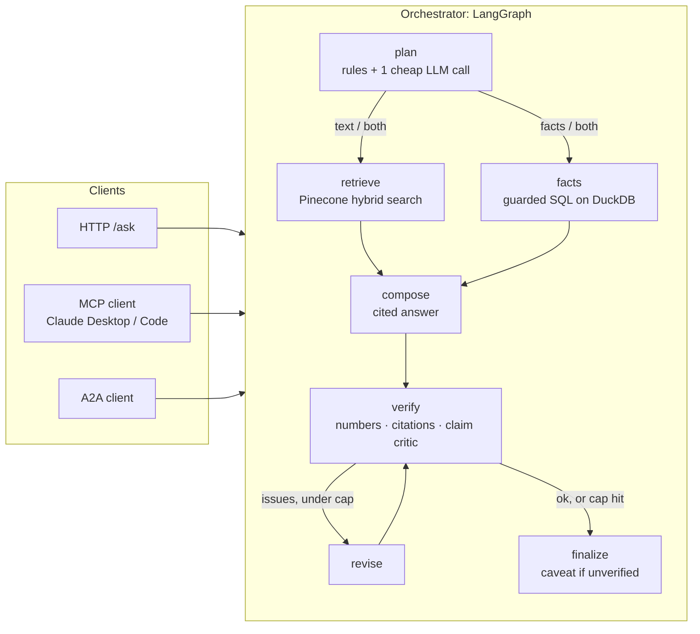
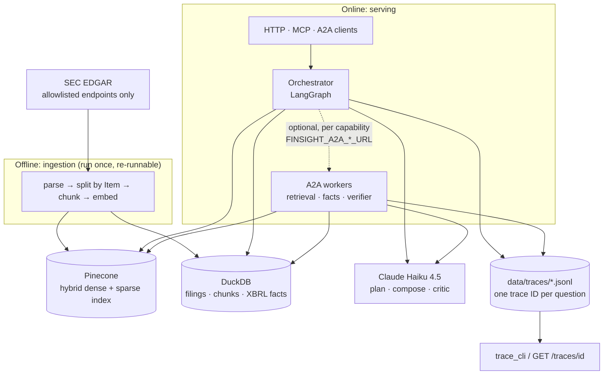

# FinSight

[](https://github.com/AtharvaMusale/finsight/actions/workflows/ci.yml)

An agentic RAG analyst over public SEC filings (10-K and 10-Q for Apple, Microsoft and NVIDIA,
roughly the last three years). Ask a question in plain English; get an answer where **every claim
carries a citation**, **every number comes from a database or a calculator (never from the
model)**, and **a verifier checks the answer against its evidence before you see it**.

It demonstrates RAG, agents, MCP and A2A in one small, testable codebase.

> Not financial advice. FinSight summarises public filings; it does not recommend anything.

## How it works



| Stage | What it does |
|---|---|
| **Ingest** (once) | Downloads filings from the SEC's documented endpoints, splits them by section (Item 1A, Item 7, ...), chunks them, embeds the chunks into Pinecone, and loads the XBRL financial facts into DuckDB. |
| **Plan** | Rules extract tickers, years, form type and section cues. One small LLM call decides whether the question needs numbers, an explanation, or both. A comparison becomes one sub-query per company and year. |
| **Retrieve** | One hybrid (dense + sparse) Pinecone search with a metadata filter (ticker, year, form, section). |
| **Facts** | Text-to-SQL over a read-only view of the XBRL facts. The SQL must be a single allowlisted `SELECT`. A calculator does growth and margins. |
| **Compose** | Claude Haiku 4.5 writes the answer, labelling claims `[C#]` (filing text), `[F#]` (database row) or `[K#]` (calculation). |
| **Verify** | Checks that every number appears in the evidence, every label exists, and every claim is backed by a verbatim quote that code confirms is really in the cited text. |
| **Revise / finalize** | Problems go back to the writer once. Anything still unsupported gets a caveat added by code. |

And the whole system, including where the data lives:



- **Two stores.** Pinecone holds passages for search; DuckDB holds the structured data and is
  opened read-only when answering.
- **A2A workers are optional.** With no `FINSIGHT_A2A_*_URL` set, everything runs in one process.

## Quickstart

Requirements: macOS or Linux, Python 3.11, [uv](https://docs.astral.sh/uv/), a free
[Pinecone](https://www.pinecone.io/) account and an [Anthropic](https://console.anthropic.com/)
API key. Run everything from the repository folder.

**1. Install and configure**

```bash
git clone git@github.com:AtharvaMusale/finsight.git
cd finsight
cp .env.example .env
uv sync
uv run pytest            # offline tests, no network needed
```

Edit `.env` and set:
- `FINSIGHT_SEC_USER_AGENT="<app name> <your real email>"` (the SEC requires a real contact)
- `PINECONE_API_KEY=...`
- `ANTHROPIC_API_KEY=...`

Keys live only in `.env`, which is gitignored.

**2. Ingest the filings** (one time; re-running does not duplicate anything)

```bash
uv run python -m finsight.ingestion.pipeline
```

**3. Start the API and ask a question**

```bash
uv run uvicorn finsight.api.app:app --host 127.0.0.1 --port 8000
```

In a second terminal:

```bash
curl -s localhost:8000/ask -H 'content-type: application/json' \
     -d '{"question": "What drove growth in Azure and other cloud services at Microsoft in fiscal 2025?"}'
```

**4. Look at what happened**

```bash
uv run python -m finsight.trace_cli --last
```

## Using FinSight

Four ways in. All of them run the same pipeline and leave a trace you can inspect.

### HTTP API

Start it as in the Quickstart. It exposes `POST /ask`, `GET /traces/{id}` and `GET /health`, and
FastAPI serves an interactive page at <http://127.0.0.1:8000/docs> where you can try `POST /ask`
from the browser.

### MCP server

Four read-only tools that any MCP client (Claude Code, Claude Desktop) can call:

| Tool | What it does | Needs |
|---|---|---|
| `calculate` | Deterministic maths: `ratio`, `pct_change`, `margin`, `cagr` (named inputs, no `eval`) | nothing |
| `query_financials` | Text-to-SQL over the XBRL facts; returns the `sql`, the `rows` and derived `calculations` | Anthropic key, DuckDB data |
| `search_filings` | Hybrid search; returns ranked passages with `ticker`, `section`, `accession_no` | Pinecone key |
| `ask_finsight` | The whole pipeline: a cited, verified answer (several model calls, so slower) | both keys |

Every response carries a `trace_id` you can open with `uv run python -m finsight.trace_cli <trace_id>`.

**Use it from Claude Code** (once, from the repository folder), then run `/mcp` inside Claude Code
to confirm `finsight` is connected:

```bash
claude mcp add finsight -- uv --directory "$(pwd)" run python -m finsight.mcp_server
```

**Try the tools directly** with the MCP Inspector. The server speaks stdio and is started by its
client, so running it by hand only waits for input.

```bash
npx @modelcontextprotocol/inspector uv run python -m finsight.mcp_server
```

Open the printed `http://localhost:6274/?MCP_PROXY_AUTH_TOKEN=...` URL, click **Connect**, then
**Tools -> List Tools**. `calculate` is a good first call because it needs no keys or data, for
example `op`: `ratio`, `inputs`: `{"numerator": 391035, "denominator": 364984}` gives `1.0714`.

### A2A agents

Retrieval, facts and verification can run as separate agents, each publishing an Agent Card. The
analyst (the API) delegates to an agent only when its URL is set; anything unset stays in-process.
Once a URL is set, `/ask` returns an error if that agent is not running, so start the workers
first, and remove the variable to go back to single-process mode.

| Agent | Command | Port |
|---|---|---|
| retrieval | `uv run python -m finsight.agents retrieval` | 9101 |
| facts | `uv run python -m finsight.agents facts` | 9102 |
| verifier | `uv run python -m finsight.agents verifier` | 9103 |
| analyst | `uv run python -m finsight.agents analyst` (optional, the API can act as analyst) | 9100 |

To try it, start the three workers (one terminal each) and read an Agent Card, which lists the
agent's name, skills and `/rpc` endpoint:

```bash
curl -s http://127.0.0.1:9101/.well-known/agent-card.json
```

Then start the API pointing at the workers (environment variables on the command line leave `.env`
untouched; put them in `.env` to make it permanent), ask a question and read the trace:

```bash
FINSIGHT_A2A_RETRIEVAL_URL=http://127.0.0.1:9101 \
FINSIGHT_A2A_FACTS_URL=http://127.0.0.1:9102 \
FINSIGHT_A2A_VERIFIER_URL=http://127.0.0.1:9103 \
uv run uvicorn finsight.api.app:app --host 127.0.0.1 --port 8000
```

Each worker terminal logs a `POST /rpc`, and in the trace every `a2a.call` span in `[api]` has a
matching `a2a.handle` span in `[retrieval]`, `[facts]` or `[verifier]`.

### CLI

Retrieval plus a cited answer, without the orchestrator. `--retrieve-only` prints just the ranked
passages.

```bash
uv run python -m finsight.retrieval.cli "export restrictions China" --ticker NVDA
```

## Reading a response and its trace

A real response, trimmed to its main fields:

```json
{
  "trace_id": "3e19fa254fb3444bab861c9ede1490d6",
  "answer": "According to the filing, Azure and other cloud services revenue grew 34% in fiscal 2025, driven by \"demand for our portfolio of services\" [C4].",
  "disclaimer": "Not financial advice. This is an automated summary of public SEC filings.",
  "route": "text",
  "sources": {
    "C4": {"source": "MSFT 10-K FY2025, Item 7", "accession_no": "0000950170-25-100235"}
  },
  "facts": {},
  "calculations": {},
  "verification": {"ok": true, "claims_checked": 1, "critic_ran": true, "revisions": 1, "issues": []}
}
```

Every claim carries a label (`[C4]`) that resolves under `sources` to an exact filing and section.
`route` says whether text, database facts or both were used. `verification` says the checks
passed, here after one revision: the first draft had an unsupported sentence, which was removed.

Every step records a span, and one trace ID follows a question through every service. Spans hold
counts, timings and error types only, never prompts or filing text. View them with
`uv run python -m finsight.trace_cli --last` or `GET /traces/<trace_id>`. The trace of the answer
above (timings are tiny because this run was served from the local cache):

```
trace 3e19fa254fb3444bab861c9ede1490d6   wall 14 ms   spans 13
----------------------------------------------------------------------------------------------------
ask                                    14.2 ms  [api]  question_chars=80 route=text revisions=1 verified=True
  node.plan                             0.1 ms  [api]  route=text subqueries=1
  node.retrieve                         0.7 ms  [api]  hits=6
    search                              0.5 ms  [api]  limit=30 alpha=0.5 filtered=True cached=True hits=30
  node.compose                          0.4 ms  [api]  draft_chars=436 no_evidence=False
    llm                                 0.3 ms  [api]  model=anthropic/claude-haiku-4-5-20251001 cached=True
  node.verify                           3.4 ms  [api]  issues=1 kinds=unsupported_claim critic_ran=True claims=2
    llm                                 0.2 ms  [api]  model=anthropic/claude-haiku-4-5-20251001 cached=True
  node.revise                           0.3 ms  [api]  revisions=1
    llm                                 0.2 ms  [api]  model=anthropic/claude-haiku-4-5-20251001 cached=True
  node.verify                           3.2 ms  [api]  issues=0 critic_ran=True claims=1
    llm                                 0.2 ms  [api]  model=anthropic/claude-haiku-4-5-20251001 cached=True
  node.finalize                         0.0 ms  [api]  caveat=False
----------------------------------------------------------------------------------------------------
```

The loop is visible: the first verify found one unsupported claim, revise rewrote the draft, and
the second verify passed. Turn tracing off with `FINSIGHT_TRACING=false`.

### Optional: LangSmith

Off by default. To also send traces to [LangSmith](https://smith.langchain.com), add your own key to
`.env`:

```
LANGSMITH_TRACING=true
LANGSMITH_API_KEY=...
LANGSMITH_PROJECT=finsight
```

Each question shows up as one `finsight.ask` run with a child run per graph node, plus the LLM
calls (with token usage), the Pinecone search and the SQL tool. Every run carries the same
`finsight_trace_id` as the local trace files and the `X-Trace-Id` header, so you can follow one
question across both. Unlike the local files, LangSmith receives **content** (prompts, filing
passages, answers); add `LANGSMITH_HIDE_INPUTS=true` and `LANGSMITH_HIDE_OUTPUTS=true` to send
only the structure. Runs from separate A2A worker processes appear as their own top-level runs:
filter on `finsight_trace_id` to line them up.

## Testing

```bash
uv run pytest                                   # 180 offline tests: no keys, no network
uv run ruff check . && uv run ruff format --check .
```

The tests replace Pinecone, the LLM and the network with fakes, so they exercise this code, not the
services. They cover the SQL guard, the verifier, the router, the full graph, tracing, the MCP
server, the A2A agents and the LangSmith export. CI (`.github/workflows/ci.yml`) runs exactly these
two commands on every push.

**Evaluations** call Pinecone and Claude, so they cost money. `--smoke` restricts a run to the
questions flagged as smoke tests.

```bash
uv run python -m finsight.evals.run --validate                   # every golden label matches a chunk
uv run python -m finsight.evals.run --name baseline              # retrieval metrics
uv run python -m finsight.evals.run --name e2e --e2e --verify on # full graph with the verifier
```

## Design rules

- **Filings are untrusted text.** Chunks are wrapped as data, and the verifier checks the output
  instead of trusting it.
- **Numbers never come from the model.** They come from DuckDB rows or the calculator, and the
  verifier rejects any number that appears in no evidence.
- **Tools are guarded.** SQL is read-only and allowlisted; the calculator has named operations,
  no `eval`.
- **Agents treat each other as untrusted.** Responses are schema-validated and size-capped, and a
  verifier outage fails closed with a caveat.
- **Local only.** The API, MCP and A2A agents bind to 127.0.0.1. The A2A agents have **no
  authentication**; do not expose them to a network as they are.

## Configuration

All settings are environment variables with the `FINSIGHT_` prefix (see `src/finsight/config.py`
and `.env.example`). The ones you are most likely to change:

| Variable | Default | Meaning |
|---|---|---|
| `FINSIGHT_LLM_MODEL` | `anthropic/claude-haiku-4-5-20251001` | Model for routing, SQL, answers and the critic |
| `FINSIGHT_VERIFY` / `FINSIGHT_MAX_REVISIONS` | `true` / `1` | Verifier on/off, and the revise-loop cap (0 to 3) |
| `FINSIGHT_A2A_RETRIEVAL_URL` / `_FACTS_URL` / `_VERIFIER_URL` | unset | Delegate that capability to an A2A agent (see [A2A agents](#a2a-agents)) |
| `FINSIGHT_TRACING` | `true` | Write spans to `data/traces/` |
| `LANGSMITH_TRACING` | `false` | Also send traces to LangSmith (needs `LANGSMITH_API_KEY`) |

## Project layout

```
src/finsight/
  ingestion/     SEC client, parser, chunker, embedder, Pinecone + DuckDB stores
  retrieval/     hybrid search, cited answers, cache, CLI
  orchestrator/  router, LangGraph graph, calculations, answer composition, verifier
  tools/         guarded text-to-SQL, deterministic calculator
  api/           FastAPI app (/ask, /traces, /health)
  mcp_server/    MCP server (stdio, optional streamable HTTP)
  agents/        A2A agents: retrieval, facts, verifier, analyst
  evals/         golden-set runner and metrics
  tracing.py     spans and JSONL writer;  trace_cli.py  timeline viewer
evals/golden.jsonl    the 30 golden questions      evals/results/    recorded eval runs
tests/               offline tests (fakes for Pinecone, the LLM and the network)
TASKS.md             build log: what was done at each step, results, and what is still open
```

## Data policy

Data comes only from the SEC's documented endpoints (`data.sec.gov`, `sec.gov/Archives`),
enforced by an allowlist in code, with a declared `User-Agent` that includes a contact email and a
rate limit of 5 requests/second. Filings are cached under `data/` (gitignored) and are **not
redistributed** by this repository; ingest your own copy.

## Known limitations

- Three companies and roughly three years only; the router's company list is hard-coded.
- Retrieval is decent, not perfect: hit@6 is 0.73 on the 30-question golden set, and comparisons
  across companies and years are the weak spot. Details are in `TASKS.md` and `evals/results/`.
- The verifier was measured once on 32 questions: 27 first drafts were flagged and one revision
  cut the total issues from 91 to 51. Those are the verifier's own verdicts, not human labels, and
  several flags were false positives that have since been fixed and not yet re-measured at full
  scale. Details are in `TASKS.md` (Step 9).
- No Docker Compose setup (the `docker-compose.yml` in the repo is an unused leftover). A GitHub
  Actions workflow runs lint and the offline tests on every push.
