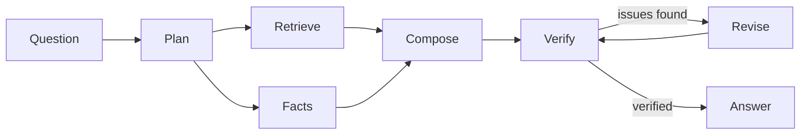

# FinSight: Verified Q&A over SEC Filings

An agentic RAG system that answers plain-English questions about Apple, Microsoft and NVIDIA 10-K/10-Q filings.

**Every claim carries a citation, every number comes from a database or a calculator (never the model), and a verifier checks the answer against its evidence before you see it.**

## Highlights

- **Cited answers:** claims are labeled with `[C#]` text citations, `[F#]` database facts and `[K#]` calculations
- **Verification loop:** a verifier checks that numbers appear in the evidence, citations exist, and claims are backed by verbatim quotes. On failure the answer is revised and re-verified up to a configurable limit
- **Hybrid retrieval:** dense + sparse search in Pinecone with metadata filtering
- **Structured facts:** guarded, allowlisted text-to-SQL over read-only XBRL financial data in DuckDB
- **Many interfaces:** HTTP API, MCP server (Claude Desktop / Claude Code), A2A agents, CLI
- **Full tracing:** a JSONL audit trail of every question with timing and spans, plus optional LangSmith
- **Evaluated and tested:** 30 golden questions for evals, 180 offline tests, CI on every push

## Architecture



1. **Plan:** rules extract metadata, then one LLM call routes the question to text, facts or both
2. **Retrieve:** hybrid Pinecone search with metadata filtering
3. **Facts:** text-to-SQL restricted to allowlisted queries over XBRL data
4. **Compose:** Claude writes the answer with claim labels
5. **Verify:** checks numbers, citations and claim support
6. **Revise / Finalize:** rewrites if issues are found, and adds caveats if something stays unverified

Retrieval, facts and verification can optionally run as separate A2A agent services.

## Tech stack

LangGraph · Pinecone · DuckDB · Claude Haiku 4.5 · FastAPI · MCP · GitHub Actions

## Project structure

```
src/finsight/
  ingestion/     SEC parsing, chunking, embedding, store loading
  retrieval/     hybrid search and cited answers
  orchestrator/  router, graph, calculations, verifier
  tools/         guarded SQL and deterministic calculator
  api/           FastAPI endpoints
  mcp_server/    MCP protocol server
  agents/        A2A worker implementations
  evals/         evaluation metrics on 30 golden questions
  tracing.py     span recording and timeline viewer
```

## Quickstart

**Requirements:** macOS/Linux, Python 3.11, [uv](https://github.com/astral-sh/uv), a free Pinecone account, an Anthropic API key.

```bash
git clone git@github.com:AtharvaMusale/finsight.git
cd finsight
cp .env.example .env     # set SEC_USER_AGENT, PINECONE_API_KEY, ANTHROPIC_API_KEY
uv sync
uv run python -m finsight.ingestion.pipeline   # ingest filings once
uv run uvicorn finsight.api.app:app --host 127.0.0.1 --port 8000
```

In another terminal:

```bash
curl -s localhost:8000/ask -H 'content-type: application/json' \
  -d '{"question": "What drove Azure growth at Microsoft?"}'
```

View traces:

```bash
uv run python -m finsight.trace_cli --last
```

## Testing

```bash
uv run pytest   # 180 offline tests, mocked services, no keys or network needed
```

CI runs lint and tests on every push via GitHub Actions.

## Design principles

- Filings are treated as untrusted text: chunks are wrapped as data, not instructions
- Numbers come only from databases or calculators
- Tools are guarded: read-only SQL, no `eval`
- Agents validate responses and fail closed on outages
- Binds to `127.0.0.1` only. A2A agents have no authentication, so don't expose them publicly

## Disclaimer

A research project, not investment advice.
