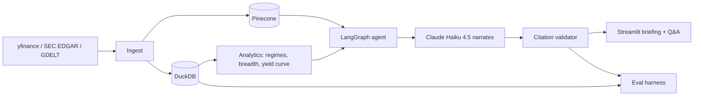

# AI Market Intelligence

A daily market briefing and Q&A system that combines prices, macroeconomic data, news headlines and SEC filings.

**All computation happens in code (DuckDB + pandas). Claude Haiku 4.5 only narrates structured results, and every claim traces to a specific data path or document URL.**

## Highlights

- **Auditable citations:** claims cite a data path or document URL, and a validator strips invalid citations before output
- **Free data:** Yahoo Finance, SEC EDGAR and GDELT, no paid sources
- **Evaluation harness:** recomputes numbers from the database to verify the model's claims
- **Streamlit dashboard:** regime analysis, sector heatmaps, yield curves and Q&A
- **Cheap to run:** local DuckDB, Pinecone free tier, and disk-cached LLM responses
- **Tested:** 59 offline tests on synthetic data

## Architecture



## Tech stack

Python · DuckDB · pandas · LangGraph · Pinecone · Claude Haiku 4.5 · Streamlit · yfinance · pytest

## Project structure

```
src/market_intel/
  ingest/      price, news and filing fetchers
  analytics/   regime calculation and data loading
  retrieval/   Pinecone chunking and indexing
  agents/      LangGraph graph, tools, prompts
  llm/         Haiku client with caching
  eval/        claim verification against DuckDB
  app/         Streamlit interface
```

## Quickstart

```bash
python3 -m venv .venv
source .venv/bin/activate
pip install -r requirements.txt
pytest                                           # free, ~5 seconds
PYTHONPATH=src python -m market_intel.scripts.run_phase1
```

**Streamlit app** (free mock writer, or about 1.6¢ per real briefing):

```bash
PYTHONPATH=src streamlit run src/market_intel/app/streamlit_app.py
```

**Daily briefing:**

```bash
PYTHONPATH=src python -m market_intel.scripts.run_briefing --dry-run
```

**Evaluation harness** (about 5¢ for a full run with the real model):

```bash
PYTHONPATH=src python -m market_intel.scripts.run_eval --run-questions
```

## Design principles

1. Numbers are computed in code, never by the LLM
2. Every claim cites sources with traceable IDs
3. Invalid citations are removed automatically by the validator
4. Data stays local (DuckDB is git-ignored) and is never republished
5. Evaluation checks numeric accuracy against the original computations

## Cost profile

| Item | Cost |
|---|---|
| Data (yfinance, EDGAR, GDELT) | Free |
| Compute (local DuckDB) | Free |
| Pinecone | Free tier (about 77k of 5M monthly tokens used) |
| Claude Haiku | About 1.6¢ per briefing, about 5¢ per full eval (cached repeats are free) |
| **Total project cost** | **About 15¢** |

## Limitations

- Yahoo Finance data is unofficial and may be delayed
- Breadth analysis covers 11 Vanguard sector ETFs, not the full S&P 500
- No credit-spread data, so the yield curve uses a 10Y–2Y proxy
- GDELT news is headlines only, with no article text
- The eval checks numbers and citations, not interpretation or directional accuracy

## Disclaimer

A research tool, not investment advice.
